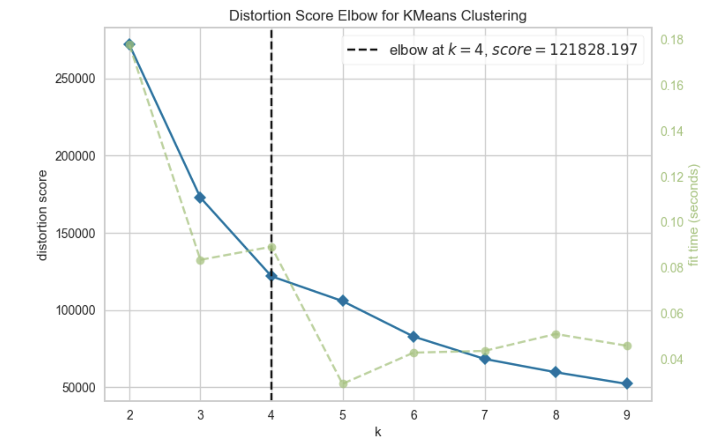
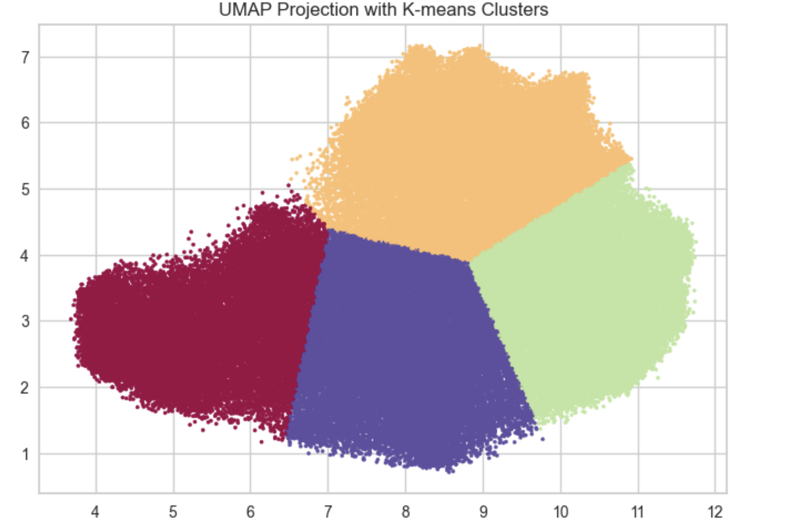
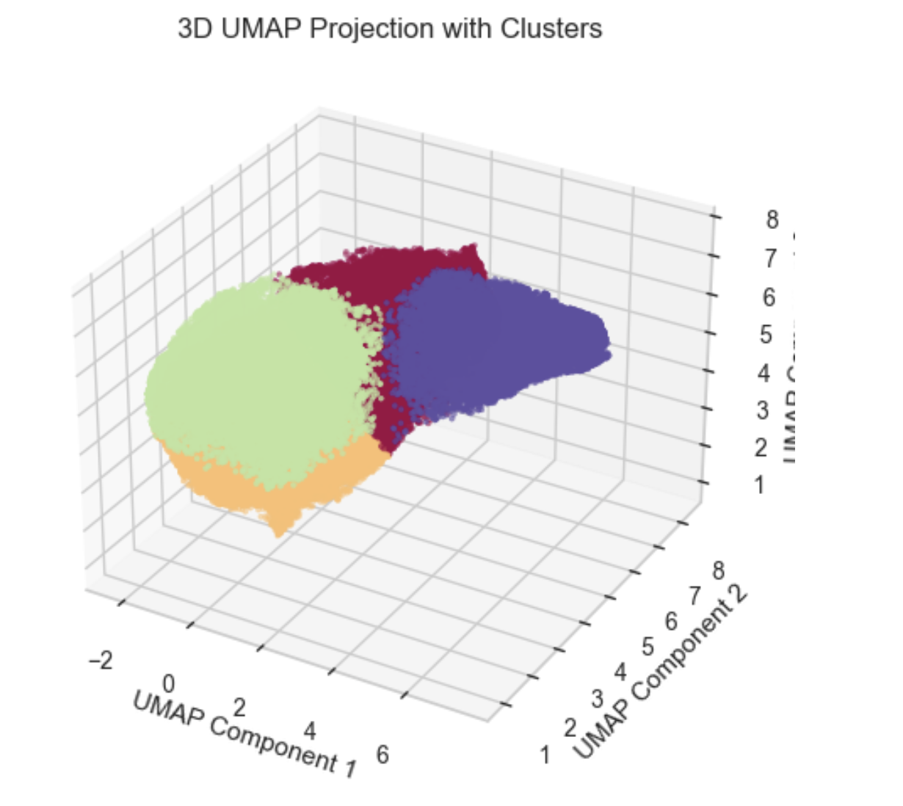

# Clustering Project 1

## Overview
This project aims to cluster a dataset of shape **(98,000 × 30)**, which consists purely of numeric features. Due to the relatively high dimensionality, the data is not easily interpretable by simple inspection. Our goal is to employ the **K-Means** algorithm to identify meaningful clusters, aided by **UMAP** for dimensionality reduction and visualization.

---

## Key Steps

### 1. Inferring Meaning from the Data
- **Descriptive Statistics**: We used `describe()` to examine the data. While the standard deviation ranged from 1 to 4, the absolute magnitudes of certain features could still overshadow others, potentially skewing distance-based methods like K-Means.
- **Scaling**: To ensure each feature contributes equally, we scaled the data. Many clustering algorithms (and UMAP) rely on distance metrics, so scaling helps preserve the true relationships between data points.

---

### 2. UMAP Implementation
UMAP (Uniform Manifold Approximation and Projection) was used to reduce the dataset’s dimensionality before clustering.

**Key Benefits of UMAP in Clustering**:
1. **Dimensionality Reduction**: Compresses high-dimensional data into fewer dimensions while retaining essential structure.
2. **Noise Filtering**: Focuses on the most relevant features, filtering out extraneous noise and improving clustering performance.
3. **Improved Clustering**: Mitigates the “curse of dimensionality,” leading to more cohesive/connected clusters.
4. **Enhanced Visualization**: Facilitates easy interpretation by projecting data onto 2D or 3D spaces.
5. **Better Interpretability**: Clusters in a reduced dimension are easier to analyze, making the insights more actionable.

We implemented UMAP with `n_components=2` to facilitate 2D visualization:

---

### 3. Elbow Method and Silhouette Score
To determine the optimal number of clusters for K-Means, we used:
- **Elbow Method**: Indicated that **k=4** is an appropriate choice.
- **Silhouette Score**: Provided additional confirmation of the quality and separation of the clusters.

---

### 4. Results
After applying UMAP for dimensionality reduction and K-Means for clustering, we visualized the results in both 2D and 3D:

1. **2D Representation**  
   

2. **3D Representation** (using `n_components=3`)  
   

These plots show distinct clusters in the reduced dimensional space, indicating that K-Means successfully separated the data into meaningful groups.

---

## Conclusion
By integrating **UMAP** for dimensionality reduction and **K-Means** for clustering, we were able to uncover coherent clusters within a high-dimensional dataset. **Scaling** the data was crucial to maintain the integrity of distance-based methods, and the **Elbow Method** combined with the **Silhouette Score** guided us to an optimal cluster count. This approach lays the foundation for further exploration, such as experimenting with alternative clustering algorithms or adjusting UMAP parameters to refine the representation of the data.
