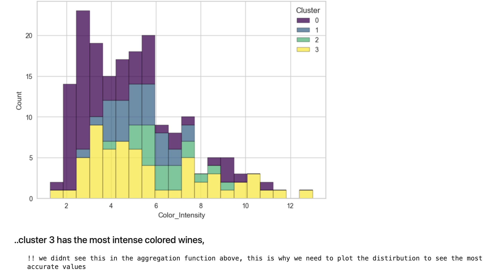

# Clustering Project 2: Wine Clustering

## Overview
This project aims to cluster various types of wine based on their chemical attributes, such as **Alcohol, Malic Acid, Ash, Magnesium, Total Phenols, Flavanoids, Color Intensity, Proline**, and more. By grouping wines with similar characteristics, we can provide **actionable insights** for wine sellers, gourmets, and enthusiasts, helping them identify and compare wines with ease.

---

## Key Steps

### 1. Determining the Number of Clusters
1. **Silhouette Score**: Initially suggested that the dataset might naturally form **2 clusters**.  
2. **Elbow Method**: Indicated that **4 clusters** would be more appropriate, balancing the trade-off between variance explained and over-segmentation.  

Based on these findings, we proceeded with **k = 4** clusters.

---

### 2. Fitting the K-Means Algorithm
After deciding on **4 clusters**, we:
1. **Scaled** the data (if necessary) to ensure each feature contributes fairly to distance calculations.  
2. **Trained** a K-Means model to partition the wine data into 4 clusters.  
3. **Predicted** cluster labels for each wine sample, allowing us to group wines by shared characteristics.

---

### 3. Inferences

1. **Cluster Profiles**  
   - The screenshot below shows a summary of each cluster. For example, wines in **Cluster 2** often exhibit **higher alcohol** and **more intense color**, aligning with a higher **Proline** level. Conversely, **Cluster 0** appears to lean toward lower alcohol and color intensity values.  

   

2. **Distribution Insights**  
   - By plotting **histograms**, we discovered that **Cluster 3** actually contains wines with the **most intense color**, a detail not fully apparent from basic aggregations alone. This highlights the importance of exploring distributions rather than relying solely on mean or median values.

   

---

### 4. Visualization Steps
We employed multiple visualization techniques to understand our clusters:

- **Boxplots**: Revealed differences in feature distributions across clusters.  
- **3D Plot (Plotly Express)**: Showed clear separation between clusters in a 3-dimensional space.  
    
- **Histograms**: Provided deeper insights into how each feature is distributed within each cluster, enabling finer-grained observations.

---

### 5. PCA for 2D Visualization
Finally, we applied **Principal Component Analysis (PCA)** to project the data into **2D space**, making it easier to see how the wines cluster together.

This 2D view confirms that our 4-cluster solution captures distinct groups of wines, each with its own characteristic profile.

---

## Conclusion
By combining **K-Means** clustering with both **Silhouette** and **Elbow** methods, we identified **4 distinct clusters** in our wine dataset. **Visualizations** such as boxplots, histograms, and PCA projections provided clarity on how these clusters differ, particularly in terms of **alcohol content**, **color intensity**, and **proline** levels.  

This approach offers **valuable insights** for wine sellers and connoisseurs, enabling them to target specific flavor profiles or chemical attributes. Future enhancements might include exploring alternative clustering algorithms (e.g., DBSCAN or Hierarchical Clustering) and testing other dimensionality reduction techniques (e.g., UMAP) to refine our understanding of the data.
